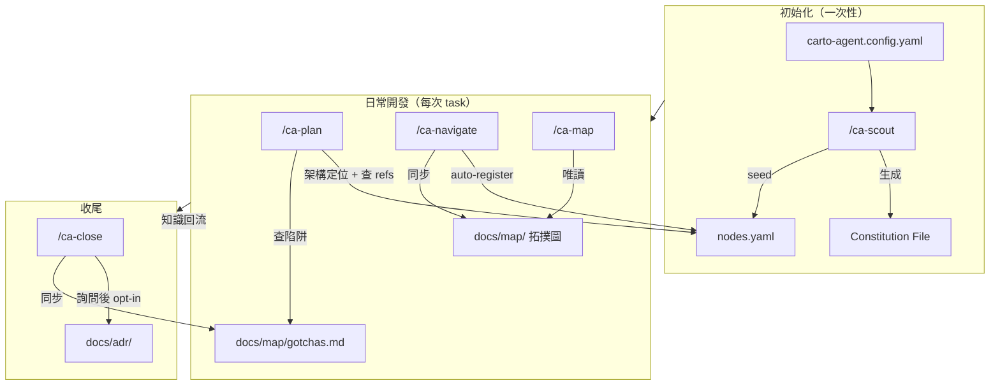
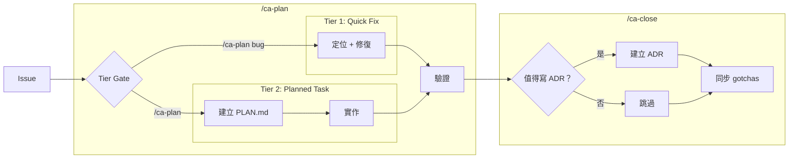
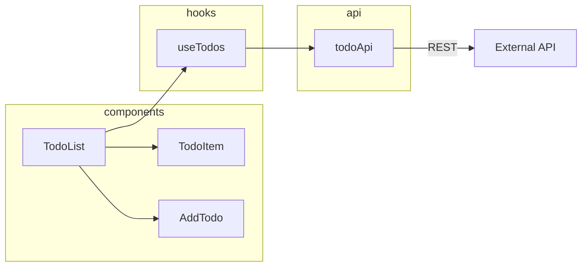

# CartoAgent

CartoAgent 是一套輕量化的 AI agent skill workflow 框架，解決 vibe coding 中的兩個核心痛點：

1. **AI 改完才發現改錯地方** — 缺乏架構定位，AI 不知道模組間的依賴和通訊關係，改 A 壞 B
2. **知識隨 session 消失** — 每次開發的決策和踩坑經驗沒有沉澱，下次又從零開始

CartoAgent 透過架構拓撲圖視覺化專案結構，在開發前定位影響範圍，開發後沉澱知識，讓每次 AI 輔助開發都有跡可循。

```
                      ┌─────────────────────────────┐
                      │ 📍 事前：架構定位 + 歷史知識   │
  "幫我修這個 bug"  →  │ 🔧 事中：Tier 分流控制範圍   │
                      │ 📝 事後：ADR + gotchas 沉澱  │
                      └─────────────────────────────┘
```

---

## 核心概念

**CartoAgent 是一個 workflow，不是工具箱。**

每個步驟有對應的 skill（markdown 檔案），照著走就會閉環。你只需要記住兩件事：

> 開始用 **`/ca-plan`**，結束用 **`/ca-close`**。其他的它會告訴你。

### Workflow 閉環

```
/ca-plan                                   /ca-close
  │                                            │
  ├─ 架構定位：這次改的是哪個模組？               ├─ 詢問：這次值得寫 ADR 嗎？
  ├─ 查歷史：上次踩過什麼坑？(ADR + gotchas)     ├─ 沉澱：決策 → ADR, 踩坑 → gotchas
  ├─ Tier 分流：bug? 重構? 架構變更?             ├─ 生成：結構化 issue comment
  └─ 實作 + 驗證                               │
                                               ↓
                                    知識沉澱到 docs/adr/ + docs/map/gotchas.md
                                               │
                              ┌────────────────┘
                              ↓
                    下次 /ca-plan 自動讀取 ← ── 閉環
```

`/ca-close` 不只是關 issue — 它會詢問你是否值得把這次的決策沉澱為 ADR，並自動同步踩坑記錄到 gotchas。下次 `/ca-plan` 會自動讀取這些知識，避免重蹈覆轍。**用得越多，agent 越懂你的專案。**

### Skills 是可編輯的 prompt

每個 skill 都是一份 markdown 檔案（`.carto-agent/skills/ca-*/SKILL.md`），不是程式碼。你可以直接編輯任何 skill 來調整流程：

- 修改 `/ca-plan` 的 Tier 判斷標準
- 在 `/ca-close` 中加入你團隊的 review checklist
- 調整 `/ca-navigate` 的 auto-register 邏輯

改了就生效，不用重新安裝。

### Agent-Agnostic

任何能讀寫檔案的 AI agent 都能使用 CartoAgent。以 Claude Code 為例：

- Constitution File: `CLAUDE.md`
- Skills 載入方式: `/ca-scout` 自動複製到 `.claude/skills/`

---

## Workflow

### 全貌



### Workflow → Skill 對應

| 階段 | 你做什麼 | 對應 Skill | 說明 |
|------|---------|-----------|------|
| **初始化** | 安裝 CartoAgent | `/ca-scout` | 一次性。讀 config → 偵察 → seed nodes.yaml |
| **開始開發** | 接到 task / issue | `/ca-plan` | **主入口**。架構定位 → 查歷史 → Tier 分流 → 實作 → 驗證 |
| **查架構** | 想看全貌或焦點圖 | `/ca-map` | 唯讀。隨時可用 |
| **深入模組** | 想了解某模組的上下文 | `/ca-navigate` | 載入上下文 + auto-register |
| **結束開發** | 開發完成 | `/ca-close` | **閉環關鍵**。詢問是否寫 ADR + distill 知識 + 生成 issue comment |
| **知識維護** | 想整理 ADR | `/ca-spec` | distill / review / check |
| **新人導覽** | 新 session 或新人 | `/ca-onboard` | 專案全貌速覽 |

日常只需要 `/ca-plan` 和 `/ca-close`。其他 skill 會在需要時被提示使用。

### Tier 分流

根據 task 規模自動分流，避免小 bug 承受過重的文件開銷：

| Tier | 觸發條件 | 流程 | 文件產出 |
|------|---------|------|---------|
| **Tier 1: Quick Fix** | 單檔修改、bug 修復 | 修 → test → commit | 無（可選加 gotcha） |
| **Tier 2: Planned Task** | 跨多檔、新模組、重構、架構變更 | 建 PLAN.md → 實作 → /ca-close 時決定是否寫 ADR | PLAN.md + gotchas + ADR（opt-in） |



---

## 安裝

### 1. 複製 template

```bash
cp -r template/.carto-agent/ your-project/.carto-agent/
cp -r template/docs/ your-project/docs/
cp template/carto-agent.config.yaml your-project/
cp template/CLAUDE.md your-project/          # Claude Code 使用者
```

### 2. 填寫 config

編輯 `carto-agent.config.yaml`，或直接執行 `/ca-scout` 進入互動模式一問一答生成。

```yaml
project:
  name: my-app
  language: zh-TW

identity:
  repo_type: single-package
  framework: [React, TypeScript]
  build_tool: Vite
  packages:
    - path: src/
      description: Main application

commands:
  install: npm install
  dev: npm run dev
  test: npm test
  lint: npm run lint
  build: npm run build

key_paths:
  modules: [src/components/, src/pages/]
  shared: [src/utils/, src/hooks/]

agent:
  type: claude-code
```

### 3. 執行 `/ca-scout`

Agent 會根據 config：
1. 生成 constitution file（CLAUDE.md / .cursorrules / etc.）
2. 偵察 codebase 結構
3. Seed 代表性模組到 `docs/nodes.yaml`
4. 輸出初始架構拓撲圖

如果不想手動填 config，直接執行 `/ca-scout`，agent 會一問一答完成設定。

---

## 入門範例：todo-app

以一個 React Todo App 走完閉環流程。

### 前提

```
todo-app/
├── src/
│   ├── components/
│   │   ├── TodoList.tsx
│   │   ├── TodoItem.tsx
│   │   └── AddTodo.tsx
│   ├── hooks/
│   │   └── useTodos.ts
│   ├── api/
│   │   └── todoApi.ts
│   └── App.tsx
└── package.json
```

### Step 1: `/ca-scout` — 初始化

```
> /ca-scout

✅ carto-agent.config.yaml found
🔧 Generated CLAUDE.md
🔧 Created docs/nodes.yaml, docs/map/gotchas.md, docs/adr/INDEX.md

Discovering modules...
  Found: TodoList, TodoItem, AddTodo, useTodos, todoApi

Seeding 3 representative nodes...
  📍 TodoList   → group: components, edges: [TodoItem, useTodos]
  📍 useTodos   → group: hooks, edges: [todoApi]
  📍 todoApi    → group: api, comm: [rest-api → backend]
```



### Step 2: `/ca-plan bug` — 修 bug（Tier 1 閉環）

```
> /ca-plan bug

📍 Where is the bug?
> TodoItem checkbox 點了沒反應

📍 TodoItem
  Group: components
  Edges: [useTodos]

🔍 Checking gotchas... none found        ← 第一次用，知識庫是空的
🔍 Checking ADRs... none found

→ Tier 1: Quick Fix
  定位 src/components/TodoItem.tsx
  找到 onChange handler 沒有呼叫 toggleTodo
  修復 → npm test ✅
  建議 commit: fix: wire up TodoItem checkbox onChange handler
```

```
> /ca-close

→ Tier 1: 跳過 distill
  生成 issue comment ✅
  💡 發現 gotcha: TodoItem 的 onChange 需要從 useTodos 解構 toggleTodo
  → 已寫入 docs/map/gotchas.md           ← 知識開始沉澱
```

### Step 3: `/ca-plan` — 新功能（Tier 2 閉環）

```
> /ca-plan

📍 Task?
> 新增 filter 功能，按 all/active/completed 篩選 todos

→ Tier 2: Planned Task
  影響: TodoList + 新增 useFilter hook + 新增 FilterBar component
  建立 PLAN: docs/tmp/draft-PLAN.md

  👉 想看這個模組在架構中的位置？執行 /ca-map TodoList
  👉 想看全貌圖？執行 /ca-map

  ⚡ Auto-registered: FilterBar (components)
  ⚡ Auto-registered: useFilter (hooks)

  實作 → 測試 ✅ → 更新拓撲圖
```

```
> /ca-close

→ Tier 2: 分析變更
  關鍵決策：新增 useFilter hook 管理篩選狀態，FilterBar 為純 UI 元件
  ❓ 這次的決策值得寫 ADR 嗎？
> 是

  ✅ 建立 ADR: docs/adr/001-todo-filter.md
  ✅ 更新 nodes.yaml refs
  ✅ 同步 gotchas
  ✅ 生成 issue comment
```

### Step 4: 知識回流 — 下次 `/ca-plan` 自動讀取

```
> /ca-plan bug

📍 Where is the bug?
> TodoList 的 filter 選 completed 後，新增 todo 不會出現

📍 TodoList
  Group: components
  Edges: [TodoItem, useTodos, FilterBar]

🔍 Checking gotchas...
  ⚠️ #1: TodoItem onChange 需要從 useTodos 解構 toggleTodo  ← 上次沉澱的！
🔍 Checking refs in nodes.yaml...
  📚 ADR-001: todo-filter — useFilter 管理篩選狀態         ← 上次沉澱的！

→ Tier 1: Quick Fix（有歷史知識輔助定位）
```

**這就是閉環 — 用得越多，agent 越懂你的專案。**

### 隨時查看架構

```
> /ca-map                    # 全貌圖
> /ca-map useTodos           # 焦點圖：useTodos 的上下游
> /ca-onboard                # 專案導覽
```

---

## 知識管理

### nodes.yaml — 架構的壓縮索引

大型專案的 AI 輔助開發有一個實際瓶頸：**context window 有限，整個 codebase 塞不下。**

`nodes.yaml` 是 CartoAgent 的解法 — 一個輕量的路由表，每個模組只記錄 name / path / group / comm / edges / refs。Agent 讀一個幾十行的檔案就能掌握整個專案的架構拓撲，不需要掃描幾百個檔案：

- `/ca-plan` 定位模組時，讀 nodes.yaml 而不是遍歷目錄
- `/ca-map focus` 計算焦點圖時，從 nodes.yaml 即時算出上下游，不讀原始碼
- `/ca-navigate` 載入上下文時，只深入目標模組，其他模組靠 nodes.yaml 提供全局視角

nodes.yaml 的思路是**只給 agent 一張地圖，需要時再深入特定區域**，而非把整個 codebase 壓成一個大 context 餵給 AI。

### 知識檔案一覽

| 文件 | 用途 | 維護方式 |
|------|------|---------|
| `carto-agent.config.yaml` | 專案設定 | 手動 or `/ca-scout` 互動生成 |
| `docs/nodes.yaml` | 架構壓縮索引 | `/ca-scout` seed + `/ca-navigate` auto-register |
| `docs/map/` | 架構拓撲視圖（受 [C4 model](https://c4model.com/) 啟發） | `/ca-navigate` 自動生成 |
| `docs/map/gotchas.md` | Non-obvious 知識 | `/ca-close` 同步 + 手動 |
| `docs/adr/` | 架構決策記錄 | `/ca-close` 時使用者決定是否建立 |

### 漸進成長

1. `/ca-scout` seed 3-5 個代表性模組
2. 每次 `/ca-navigate {module}` 自動 register 新模組
3. `nodes.yaml` 隨使用自然成長
4. 拓撲圖由 `/ca-navigate` 自動同步

---

## 專案結構

```
carto-agent/
├── README.md                        # 本文件
├── template/                        # 通用 template
│   ├── carto-agent.config.yaml      # 專案設定模板
│   ├── CLAUDE.md                    # Constitution file 模板（Claude Code）
│   ├── .carto-agent/skills/         # 7 個 ca-* skills（可編輯的 markdown）
│   │   ├── ca-scout/SKILL.md
│   │   ├── ca-navigate/SKILL.md
│   │   ├── ca-map/SKILL.md
│   │   ├── ca-plan/SKILL.md
│   │   ├── ca-spec/SKILL.md
│   │   ├── ca-close/SKILL.md
│   │   └── ca-onboard/SKILL.md
│   └── docs/                        # 知識管理骨架
│       ├── nodes.yaml
│       ├── map/gotchas.md
│       └── adr/
└── docs/                            # 設計文件、分析筆記
```

## 設計原則

1. **Workflow, not toolbox** — 是一套閉環流程，不是獨立工具的集合
2. **Agent-Agnostic** — 純 markdown 指令集，不綁定特定 AI agent
3. **Config-Driven** — 一個 YAML 驅動初始化
4. **Skills 可編輯** — 改 markdown 就能調整流程，不用改 code
5. **漸進成長** — 從偵察開始，隨使用自然擴充
6. **知識閉環** — `/ca-close` 沉澱的知識，下次 `/ca-plan` 自動讀取
7. **Tier 分流** — 小 bug 不需要 ADR，大功能不會跳過規劃