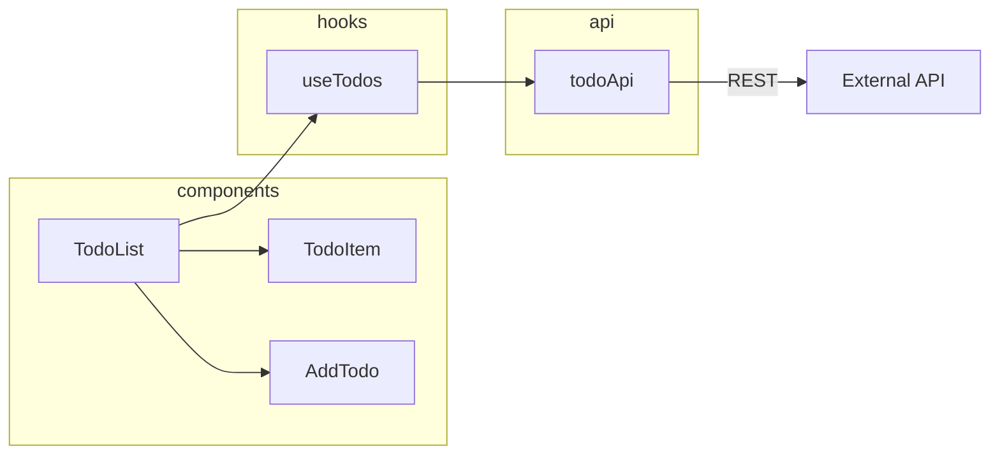

# 入門範例：todo-app

以一個 React Todo App 走完閉環流程。

## 前提

```
todo-app/
├── src/
│   ├── components/
│   │   ├── TodoList.tsx
│   │   ├── TodoItem.tsx
│   │   └── AddTodo.tsx
│   ├── hooks/
│   │   └── useTodos.ts
│   ├── api/
│   │   └── todoApi.ts
│   └── App.tsx
└── package.json
```

## Step 1: `/ca-scout` — 初始化

```
> /ca-scout

✅ carto-agent.config.yaml found
🔧 Generated CLAUDE.md
🔧 Created docs/nodes.yaml, docs/map/gotchas.md, docs/adr/INDEX.md

Discovering modules...
  Found: TodoList, TodoItem, AddTodo, useTodos, todoApi

Seeding 3 representative nodes...
  📍 TodoList   → group: components, edges: [TodoItem, useTodos]
  📍 useTodos   → group: hooks, edges: [todoApi]
  📍 todoApi    → group: api, comm: [rest-api → backend]
```



## Step 2: `/ca-plan bug` — 修 bug（Tier 1 閉環）

```
> /ca-plan bug

📍 Where is the bug?
> TodoItem checkbox 點了沒反應

📍 TodoItem
  Group: components
  Edges: [useTodos]

🔍 Checking gotchas... none found        ← 第一次用，知識庫是空的
🔍 Checking ADRs... none found

→ Tier 1: Quick Fix
  定位 src/components/TodoItem.tsx
  找到 onChange handler 沒有呼叫 toggleTodo
  修復 → npm test ✅
  建議 commit: fix: wire up TodoItem checkbox onChange handler
```

```
> /ca-close

→ Tier 1: 跳過 distill
  生成 issue comment ✅
  💡 發現 gotcha: TodoItem 的 onChange 需要從 useTodos 解構 toggleTodo
  → 已寫入 docs/map/gotchas.md           ← 知識開始沉澱
```

## Step 3: `/ca-plan` — 新功能（Tier 2 閉環）

```
> /ca-plan

📍 Task?
> 新增 filter 功能，按 all/active/completed 篩選 todos

→ Tier 2: Planned Task
  影響: TodoList + 新增 useFilter hook + 新增 FilterBar component
  建立 PLAN: docs/tmp/draft-PLAN.md

  👉 想看這個模組在架構中的位置？執行 /ca-map TodoList
  👉 想看全貌圖？執行 /ca-map

  ⚡ Auto-registered: FilterBar (components)
  ⚡ Auto-registered: useFilter (hooks)

  實作 → 測試 ✅ → 更新拓撲圖
```

```
> /ca-close

→ Tier 2: 分析變更
  關鍵決策：新增 useFilter hook 管理篩選狀態，FilterBar 為純 UI 元件
  ❓ 這次的決策值得寫 ADR 嗎？
> 是

  ✅ 建立 ADR: docs/adr/001-todo-filter.md
  ✅ 更新 nodes.yaml refs
  ✅ 同步 gotchas
  ✅ 生成 issue comment
```

## Step 4: 知識回流 — 下次 `/ca-plan` 自動讀取

```
> /ca-plan bug

📍 Where is the bug?
> TodoList 的 filter 選 completed 後，新增 todo 不會出現

📍 TodoList
  Group: components
  Edges: [TodoItem, useTodos, FilterBar]

🔍 Checking gotchas...
  ⚠️ #1: TodoItem onChange 需要從 useTodos 解構 toggleTodo  ← 上次沉澱的！
🔍 Checking refs in nodes.yaml...
  📚 ADR-001: todo-filter — useFilter 管理篩選狀態         ← 上次沉澱的！

→ Tier 1: Quick Fix（有歷史知識輔助定位）
```

**這就是閉環 — 用得越多，agent 越懂你的專案。**

## 隨時查看架構

```
> /ca-map                    # 全貌圖
> /ca-map useTodos           # 焦點圖：useTodos 的上下游
> /ca-onboard                # 專案導覽
```
