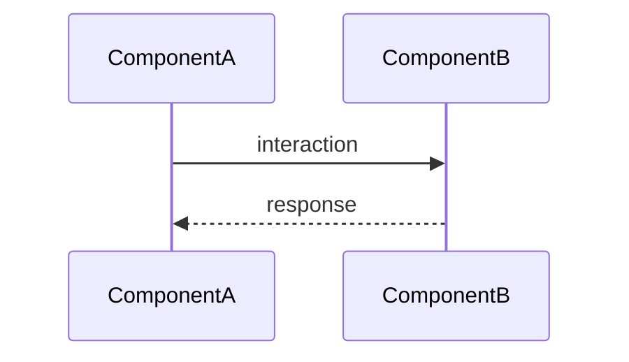

# ADR-{id}: {title}

## Status

{Proposed | Accepted | Done | Superseded}

## Context

{問題描述和背景}

## Decision

{決策內容和理由。只記錄 issue 沒有的實作層知識。}

## Architecture (optional)

## Consequences

{影響和 trade-offs}

## Gotchas

{實作中發現的 non-obvious 知識，完成後同步到 docs/map/gotchas.md}

## Affected Components

- `{module}` — {change summary}